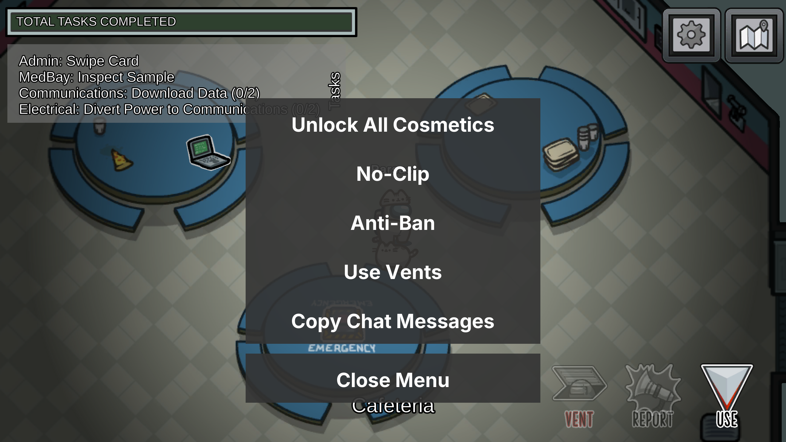

Here's the updated version with your addition:

---

# **Yet Another Mod Menu for Among Us**

## **Launch the Menu**
Press **F7** to open the mod menu. Ensure you're already in the game for the menu to work properly.

---

## **Setup: How to Install Among Us Menu**

1. **Download BepInEx Bleeding Edge**
   Get it from: [BepInEx Bleeding Edge Builds](https://builds.bepinex.dev/projects/bepinex_be).

2. **Extract Files**  
   Unzip the BepInEx files into your Among Us installation directory.

3. **Add the Mod**  
   Copy `AmongUsMenu.dll` to the `BepInEx\plugins` folder.

4. **Optional but Recommended**  
   Install the [Open Sans font](https://fonts.google.com/specimen/Open+Sans) for a cleaner and more polished UI experience.

---

## **FAQ: Frequently Asked Questions**

**Q: Why not use MelonLoader instead of BepInEx?**
**A:** MelonLoader unfortunately crashes when used with Among Us.

**Q: Why use the Bleeding Edge version of BepInEx instead of the Stable version?**
**A:** The Stable version doesn't work with Among Us. The Bleeding Edge version is required to run BepInEx for this game.
Get it here: [BepInEx Bleeding Edge Builds](https://builds.bepinex.dev/projects/bepinex_be).

---

## **Acknowledgments**
Among Us Menu was made possible thanks to:
- [BepInEx Framework](https://github.com/BepInEx/BepInEx)
- [Il2CppDumper](https://github.com/Perfare/Il2CppDumper)
- [Open Sans Font](https://fonts.google.com/specimen/Open+Sans)

